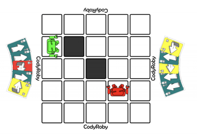
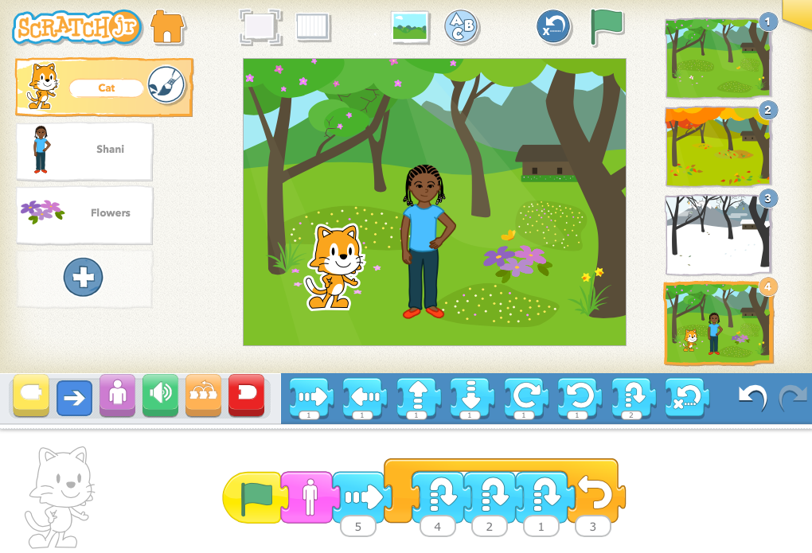

#  INTRODUCCIÓN A LA ROBÓTICA Y AL PENSAMIENTO COMPUTACIONAL EN INFANTIL

## [https://bit.ly/rob-infantil](https://bit.ly/rob-infantil)

Enero 2023

Licencia CC by SA @javacasm

## Objetivos

- Desarrollar y mejorar la Competencia Digital docente conforme a los niveles establecidos en el Marco de Referencia de la Competencia Digital Docente (MRCDD).
- Facilitar la alfabetización digital para el aprendizaje de competencias.
- Introducción al pensamiento computacional en el entorno de juegos.
- Desarrollar estrategias de resolución de problemas.
- Primeros pasos de programación mediante bloques.
- Usar transversalmente herramientas computacionales.

## Contenidos

- [El pensamiento computacional y los juegos](./scratch/9.0.PC_Unplugged.md)
- Juegos de pensamiento computacional desconectado.
- [Robótica en educación](./scratch/8.0.RoboticaIntroduccion.md)
- Robótica en educación infantil: [escornabot](./robots/escornabot.md) y [beebot](./robots/beebot.md).
- [Robótica en educación primaria](./scratch/8.1.0.RoboticaPrimaria.md)
- Otros kits de iniciación a la robótica.
- [Programación en la educación](./scratch/1.0.ProgramacionEnEducacion.md)
- [Iniciación a la programación: Code.org](scratch/2.0.HerramientasProgramacionBloques.md)
- [Programando con bloques: Scratch Jr.](./scratch/3.2.ScratchEntabletas.md)
- [Programando con bloques: Scratch](./scratch/3.0.Scratch3.0.md)
- [Placa Makey-Makey y su uso con Scratch](./scratch/8.2.QueEsMM.md)
- [Robótica con micro:bit](./microbit/0.Introduccion.md)
- Apps para iniciación a la programación.
- [Uso de impresoras 3D](./3D/README.md)
- [Introducción al diseño 3D](./3D/9.0.HerramientasDiseño3D.md)

## Descripción

Este curso trata sobre la programación y la Robótica en la Etapa de Educación Infantil como vehículo para el aprendizaje interdisciplinar, utilizando una pedagogía basada en el juego que amplíe lo que el profesorado ya hace de manera habitual en sus aulas en su día a día, de forma que puedan guiar a su alumnado a reconocer y comprender los aspectos fundamentales del Pensamiento Computacional.
Es una propuesta pedagógica dentro de la red estratégica del DUA, para proporcionar múltiples formas de acción y expresión. Da respuesta al cómo del aprendizaje.
Con esta actividad formativa se trabajan las siguientes competencias del Marco de Referencia de la
Competencia Digital Docente:

1.3. Práctica Reflexiva nivel A2
1.4. Desarrollo profesional digital continuo (DPC) nivel A2
2.1. Búsqueda y selección de contenidos digitales nivel A2.
2.2. Creación y modificación de contenidos digitales nivel A2
2.2. Creación y modificación de contenidos digitales nivel B1
3.1. Enseñanza nivel A2.

«Actividad financiada por el Programa para la mejora de la competencia digital educativa #CompDigEdu,
en el marco del componente 19 «Plan nacional de capacidades digitales» del Mecanismo de Recuperación
y Resiliencia (MRR). Plan de Recuperación, Transformación y Resiliencia-Financiado por el Ministerio
de Educación y Formación Profesional y por la Unión Europea ¿NextGenerationEU»

## Niveles y herramientas

Ed. Infantil: 

* Uso de escornabot con tapetes adecuados
* Uso de proyectos con makey-makey y scratch
* Juegos de pensamiento computacional desconectado
* Uso de piezas impresas en 3D

Ed. Primaria - 1er ciclo
* Uso de escornabot
* Programación con Scratch Jr
* Uso de makey-makey
* Juegos de pensamiento computacional desconectado
* Uso de piezas impresas en 3D

Ed. Primaria - 2º ciclo
* Uso y montaje de makey-makey 
* Programación con Scratch
* Juegos de pensamiento computacional desconectado
* Introducción al diseño 3D

Ed. Primaria - 3er ciclo
* Programación de micro:bit
* Montaje de makey-makey
* Programación de scratch 
* Montaje de Escornabot
* Juegos de pensamiento computacional desconectado
* Diseño 3D con Tinkercad
* Uso de impresoras 3D

## Herramientas

[Pensamiento computacional desconectado](https://csunplugged.org/es/)

[Escornabot](https://escornabot.com/es/index)

[Tapetes para escornabot](https://pablorubma.cc/escornabot/tableros-y-recursos/)

[micro:bit](http://microbit.org/)

[Scratch Jr.](https://www.scratchjr.org/)

[Scratch](https://scratch.mit.edu/)

[Tinkercad](https://tinkercad.com)

### Recursos

[Propuesta con objetivos mínimos para cada nivel educativo de Intef](http://code.intef.es/wp-content/uploads/2018/10/Ponencia-sobre-Pensamiento-Computacional.-Informe-Final.pdf#page=65)