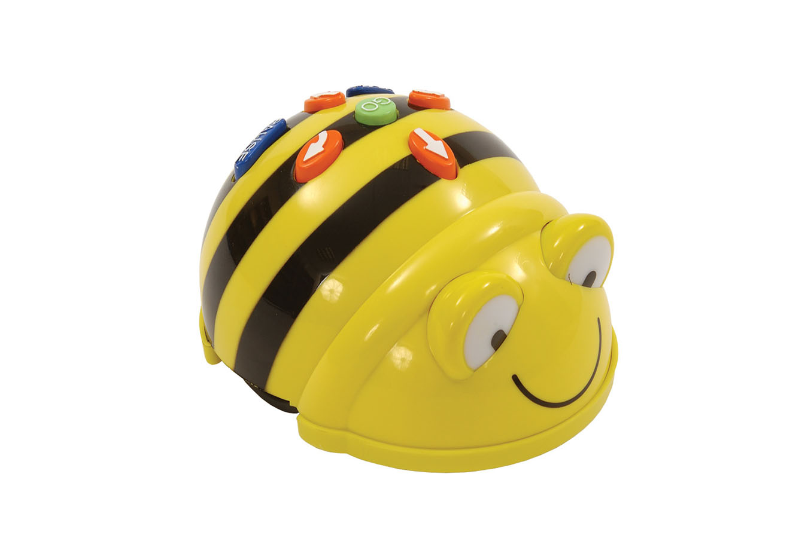

## Beebot

[Simulador Beebot](https://scratch.mit.edu/projects/644012348)

[App beebot](https://play.google.com/store/apps/details?id=com.tts.beebot)

[Ejemplos de Creciendo con Montessori](https://www.creciendoconmontessori.com/2017/03/robotica-educativa-con-bee-bot-cartas-de-secuencia-para-imprimir.html)

[Tutoriales beebot](https://www.programoergosum.es/tutoriales/robotica-educativa-con-beebot/)

[Más tutoriales beebot](https://rafaelfernandezmayoralas.es/bee-bot/)

[Compras beebot](https://ro-botica.com/tienda/bee-bot)

[Robot de suelo con Mi cajon de sastre infantil](https://micajondesastreinfantil.blogspot.com/search/label/Robotica)

## Clones de beebot

[Doc clementoni](https://micajondesastreinfantil.blogspot.com/2018/10/doc-clementoni-un-robot-para-los-peques.html)

[Robot mouse](http://laclasedemiren.blogspot.com/2017/01/taller-de-robotica-os-presentamos.html)

[Robot mouse 2](https://aprenderconrobots.com/robots-programables/bee-blue-bot-y-robot-mouse/)

## Tapetes

[Tapetes programamos](https://programamos.es/recursos/beebots/)

[Tapetes curso de la Xunta](https://www.edu.xunta.gal/centros/cfrpontevedra/aulavirtual/mod/folder/view.php?id=6281)

[Tapetes Comunication 4 All](http://www.communication4all.co.uk/http/beebot.htm)

[Tapetes EarlyLearning](https://www.earlylearninghq.org.uk/themes/themed-bee-bot-mats/)

[Tapetes Educación Navarra](https://codigo21.educacion.navarra.es/recursos/alfombras-para-bee-bots/)

[Tapetes y fichas de aprende jugando con Selaidru](https://aprendejugandoconselaidru.blogspot.com/search?q=beebot)

[Talleres de Miren](http://laclasedemiren.blogspot.com/2017/01/taller-de-robotica-os-presentamos.html)

