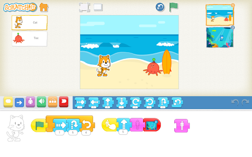

## Scratch Jr.

[Scratch Jr.](https://www.scratchjr.org) es una versión adaptada para los más pequeños, con menos bloques pero con casi toda la funcionalidad de la otra versión. Los bloques se colocan en líneas para simplificar.

Al ser software abierto, existen versiones no oficilanes para escritorio [para Mac y Windows](https://jfo8000.github.io/ScratchJr-Desktop/) y para [Linux](https://github.com/JustSch/ScratchJr-Desktop/releases/tag/v1.3.5) (Gracias Beatriz!!)
