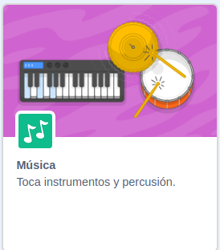

## Interacción

¿Qué es la interacción?

A lo largo de esta sesión vamos a ver distintas formas de interaccionar con el usuario, entre los personajes, ...

El objetivo es comunicarnos con el usuario de una forma realista.

Interacción con el Usuario:
* Hacerlo protagonista
* Comunicarnos con él:
    * Preguntar
    * Responder
    * Dirigirnos a él
* Despertar sus sentidos:
    * Imágenes
    * Música
    * Sonido
    * Hablarle
* Detectar sus movimientos
    * Teclado
    * Ratón
    * Vídeo
    * Sonido

Entre los personajes:
* Dándoles movimiento
* Haciendo que interacciones entre ellos
    * Moviéndose
    * Chocando
* Usando
    * Imágenes
    * Música
    * Sonido
* Detectar sus movimientos
    * Teclado
    * Ratón
    * Vídeo

Para hacer esta interacción utilizaremos los **Eventos** que ya hemos utilizado antes (y alguno nuevo):

También usaremos los bloques de la paleta "**Sensores**"

Además de algunas extensiones que nos van a permitir:

* Detectar los movimientos usando una cámara web "**Sensor de Vídeo**".

* Crear "**Música**" con la extensión del mismo nombre.

* Escuchar textos hablados con la extensión "**Texto a Voz**", veremos que podemos usarla para trabajar los idiomas.

En la siguiente sesión veremos cómo trabajar la interacción con Hardware, usando la conocida MakeyMakey

[Vídeo: Interacción en Scratch 3.0](https://youtu.be/V_joIGGFx-k)

