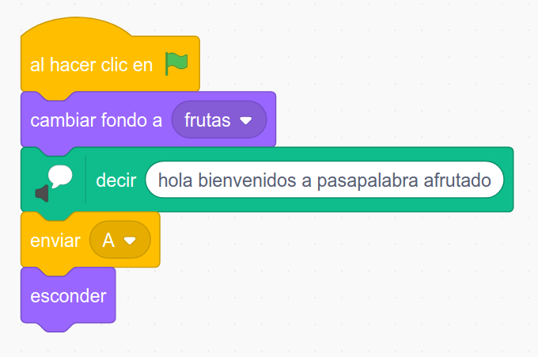
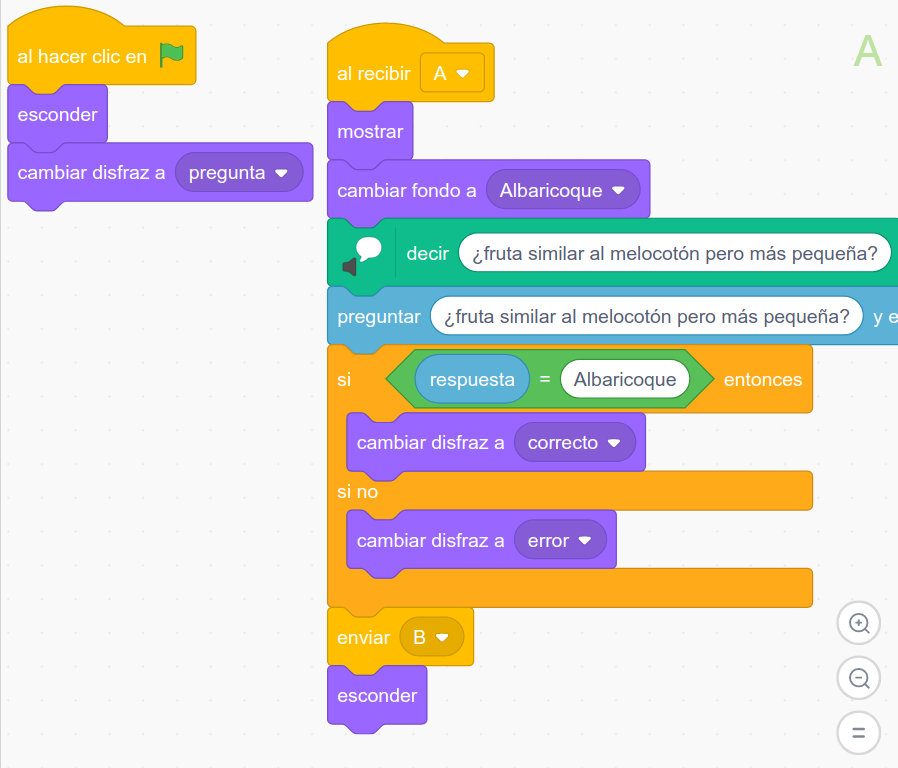
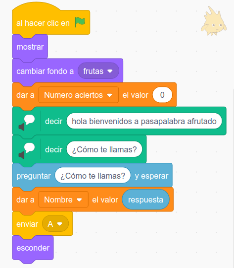
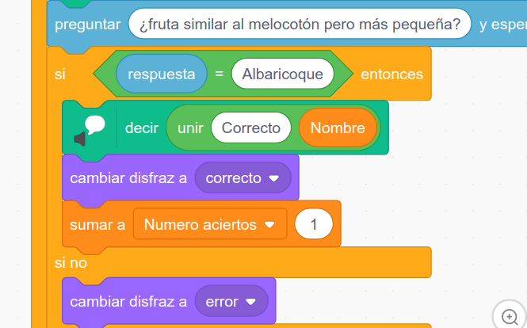
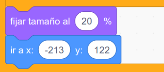
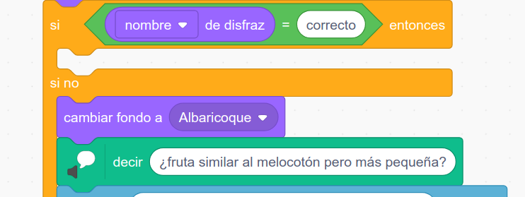
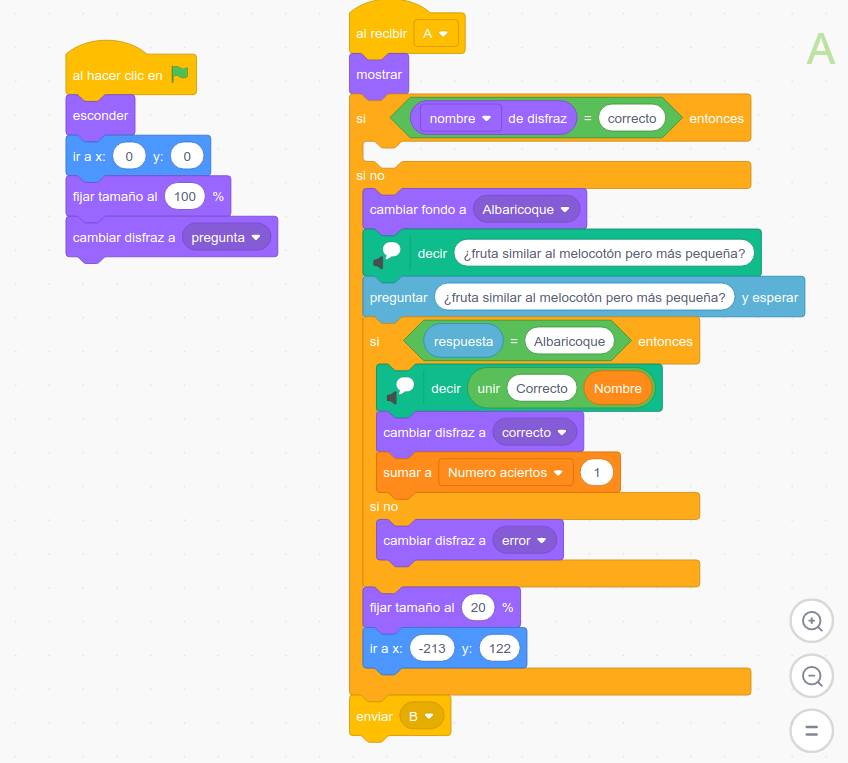
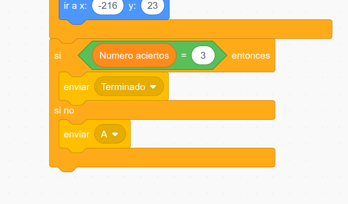
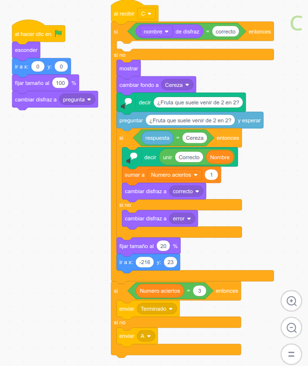
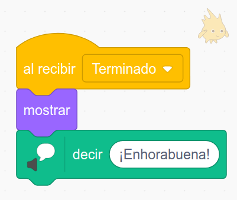

## Ejemplo: Clon de Pasapalabra

Vamos a utilizar lo aprendido para hacer nuestro ejemplo de Pasapalabra.

Tendremos un personaje inicial que hará de presentador y nos preguntará nuestro nombre, que guardaremos en una variable

También tendremos un personaje por cada letra.
Las preguntas irán apareciendo y desapareciendo, con lo que debemos usar los bloques **Mostrar** y **Esconder**, de manera que se vaya mostrando en cada caso el que queramos.

Todo los objetos/personajes deben incluir un bloque inicial del evento que ejecuta esos bloques, como por ejemplo Al hacer clic en Bandera Verde

Cada letra/pregunta debería ser un personaje y así pueden ir dándose paso entre ellos, mostrando cada uno su fondo

Para comunicar y sincronizar utilizamos Mensajes. Un mensaje es como un evento que se puede enviar cuando quiera y que produce un evento cuando se recibe

En [este ejemplo a medio hacer](https://scratch.mit.edu/projects/488459060) se puede ver lo esencial. En este vídeo os muestro como lo he montado

[Vídeo: Esquema de Clon de Pasapalabra](https://youtu.be/pAf9RnJDVaY)

El presentado nos muestra un fondo inicial y da paso a la primera letra

Cada letra debe esconderse al empezar y al recibir su mensaje mostrar y hacer la pregunta

### Creando nuevas letras

Con la estructura que hemos hecho, es muy sencillo el añadir nuevas letras, sólo tenemos que duplicar los objetos y modificar en el disfraz la letra que se muestra y en el código cambiar el mensaje que se envía al terminar y el que hace que se ejecute la letra correspondiente.

En este vídeo se ve cómo hacerlo.

[Vídeo: Como duplicar fácilmente los objetos/personajes den un juego similar a Pasapalabra](https://youtu.be/Bx2B7oI_uSM)

[Este proyecto](https://scratch.mit.edu/projects/488489208/) es el resultado

### Conteo de resultamos

Vamos a añadir ahora lo necesario para llevar un conteo de los resultados. Para ello crearemos una variable "Número de aciertos" a la que pondremos el valor 0 al empezar y que incrementaremos con cada acierto.

También vamos a preguntar el nombre al usuario y guardarlo en una variable

Lo usaremos cada vez que la respuesta sea correcta, haciendo que se diga "Correcto " y seguido del nombre. Para ello uniremos el texto "Correcto" y la variable que contiene el nombre.

También vamos a hacer que se vean las letras que ya hemos acertado y cuales no. Para ello después de hacer una pregunta las moveremos a la parte de la izquierda, con el disfraz correspondiente y con un tamaño reducido al 20%

Nos queda ahora saber si una letra ya ha sido acertada o no. Para ello podemos hacer una comparación con el disfraz actual: si este es correcto podemos pasar a la siguiente y si no volveremos a hacer la pregunta.

(Hemos movido el bloque de fijar disfraz a la parte inicial)

La letra A queda así:

Por último, para evitar que se repita sin fin, en la última letra comprobamos si el número de aciertos es el de preguntas.

Quedando la última letra de esta manera

Si es así enviamos un mensaje de "Terminado" que recoja el presentador y el juego termina

Aquí tenéis [el proyecto terminado](https://scratch.mit.edu/projects/488480158)

[Vídeo: Repitiendo las letras y detectando el final](https://youtu.be/xgpYCzmt9qc)
